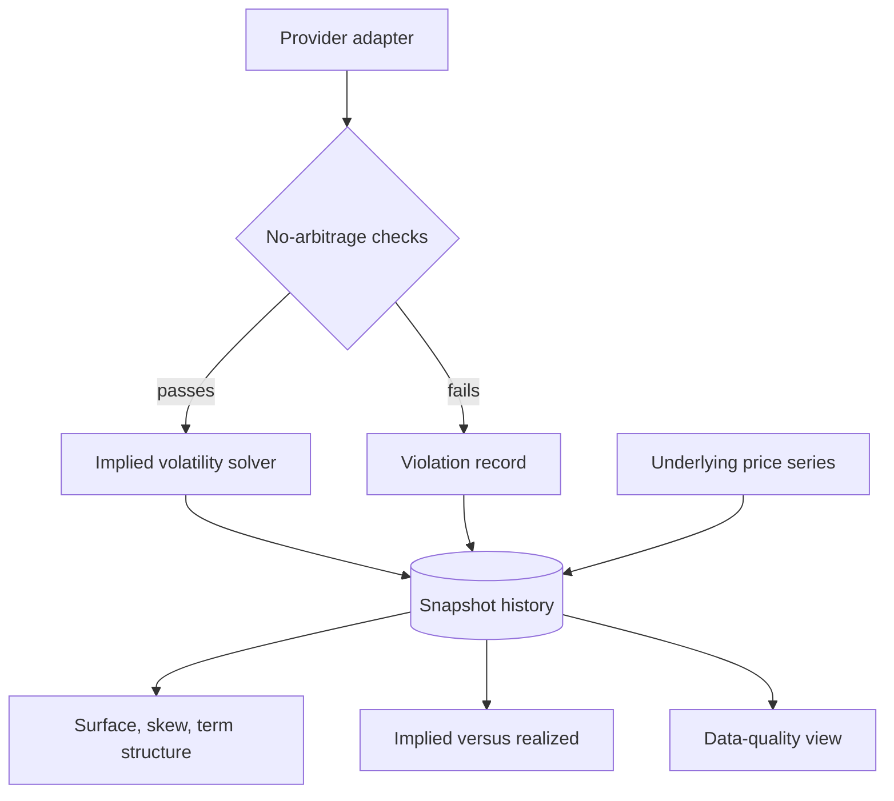

# Options Volatility Analytics - Plan

## Goal Capsule

- **Objective:** Turn an option-pricing calculator into a tested pricing library with a live-data volatility analytics application on top of it, strong enough to carry a quant developer job application.
- **Product authority:** Jay Singh Chauhan — sole developer, sole decision-maker.
- **Primary audience:** Technical reviewers evaluating the repository for quant developer and data science roles. Paying users are a later-phase audience with no requirements in this contract.
- **Open blockers:** None. The provider spike (U2) must confirm bid and ask are populated rather than merely present, but it is sequenced work rather than an unanswered question — a negative result cuts the quality gate on a stated rule instead of stalling the plan.
- **Execution profile:** Test-first where defects are known. U5 writes the convergence suite before U6 fixes anything, so the suite is proven to catch the named defects rather than asserted to. Everywhere else, normal build-then-verify. This paid for itself immediately: writing the suite first is what found the fourth defect R3 had missed, and what showed that one of the three it named costs nothing — see R3 and `docs/evidence/pre-fix-failures.md`.
- **Stop conditions:** Stop and ask before spending money on market data, before moving off the current host, and before adding a requirement that serves a paying user rather than a technical reviewer. The fallback adapter is the one pre-approved exception: once its trigger fires, build it without asking, because the thing it protects is accruing loss while the question is open. Stop and re-plan if the provider spike finds bid and ask are mostly unpopulated across every candidate symbol.
- **Tail ownership:** Stage 1b runs unattended from the moment it lands and is never "finished" — the capture job accruing history is the tail, and it outlives every other unit in this plan.

---

## Product Contract

### Summary

Package the existing pricing math as a tested, benchmarked library, add implied-volatility inversion, then feed it live option chains so it can show implied versus realized volatility and flag no-arbitrage violations. The web application becomes a JSON API behind a rebuilt JavaScript client.

### Problem Frame

The repository today is a Flask form that prices vanilla options six different ways: closed-form Black-Scholes-Merton, binomial and trinomial trees, Monte Carlo, Longstaff-Schwartz, and Crank-Nicolson finite differences. That breadth is the asset — a generated portfolio project has one pricer, not six.

The breadth is also unproven. Nothing in the repository demonstrates that the six methods agree, and at least two of them are wrong: the closed-form vega mixes two non-equivalent identities and is only correct at the money, and the Monte Carlo drift omits the dividend yield that every sibling method includes. There is no test suite, no dependency manifest, and no continuous integration, so a reviewer has no way to distinguish working code from code that merely runs.

The application has no users. It was built as a portfolio piece and is hosted on PythonAnywhere, where it serves the developer alone. Its current value proposition — a web page that computes option values — was stronger in 2024 than it is now, when any language model will produce a working pricer on request. A convergence suite and a root-finding solver are no harder to generate than the pricers themselves, so their existence proves nothing on its own.

Two things do survive that objection, and they are different kinds of evidence. The first is judgment: the convergence work is worth showing because of what it catches, not because it exists. Three defects already sit in code that runs without complaint — a vega identity correct only at the money, a Monte Carlo drift missing its dividend yield, and an American early-exercise test comparing against the previous time slice rather than the exercise payoff. Finding those in one's own work, with a mechanism built for the purpose, is specific to this codebase and cannot be generated. The second is the operational record: which quotes were rejected and why is a judgment trail that only exists if someone ran the pipeline and looked at what came back. Elapsed time was originally the claim here, on the assumption that chain history could not be backfilled — research since suggests it can be, which weakens time as a moat while strengthening this one, since a year of real rejections is better evidence than a hand-built fixture set. Six methods agreeing is table stakes underneath both — it makes the rest trustworthy rather than being the headline.

### Key Decisions

- **Resume credibility first, revenue deferred.** Every requirement here serves a technical reviewer. Monetization gets architectural room — a swappable data interface and a clean API boundary — but no implementation. Building billing before there is a single user would cost real time and signal nothing.

- **The engine is the artifact, not the application.** The pricing math is packaged as a library that the web application consumes, rather than living inside the application. For the target audience, a tested library other code could depend on is a stronger artifact than a working form. The split is cheap done early and expensive retrofitted.

- **The engine is correct and fast before anything depends on it.** Correctness first, then performance, both inside Foundation. Inversion comes later because it is a derived layer over stored quotes rather than part of the engine's own contract.

  Performance is not polish here: inverting a several-hundred-quote chain costs 5-30 pricer calls per quote, which makes American-exercise inversion through a tree method slow enough to cap how much history can be re-processed. Optimizing after the convergence suite exists means the tests protect the refactor. Optimizing before anything consumes the pricers means no downstream code is built against the slow shapes — and every test run after it, including the inversion round-trips that dominate the remaining schedule, is faster for it.

- **Raw capture is separated from inversion, so history can start before the engine is finished.** Bid, ask, strike, expiry, and underlying price are provider data; implied volatility is derived. Persisting raw quotes and computing implied volatility as a derived layer means capture can begin as soon as there is somewhere to put the code, while engine defects can never corrupt stored history — the backlog is re-inverted whenever the engine changes. This is why capture lands immediately after Foundation rather than alongside the quality gate, and why throughput is a batch constraint rather than a live-window one.

- **No-arbitrage checks are a data-quality gate, not a trading signal.** Free-tier quotes cannot support a tradeable-edge product: apparent violations are dominated by stale quotes, bid-ask spread, borrow cost, discrete dividends, and the early-exercise premium on American contracts. The same checks are genuinely valuable as an ingest filter that protects the volatility analysis from bad data, and as evidence the developer understands the bounds.

- **US equity options are the underlying market.** They read as the most legible choice to a quant reviewer, and single-name American exercise keeps the American tree methods and Longstaff-Schwartz on live data. European-only markets such as index or crypto options would have been easier to source and simpler to invert, but would leave half the six-method breadth untouched by real quotes.

- **Yahoo Finance via `yfinance` is the first provider, behind a criteria-governed adapter, with a named fallback.** Every documented alternative fails a hard constraint: Tradier and the other broker-backed APIs require a funded brokerage account with KYC, Polygon's own pricing page and endpoint docs contradict each other on whether the $29 tier returns quotes at all, and Finnhub has a reported bid-ask error exceeding 80% against a broker reference, which would poison the quality gate more thoroughly than having no quote sides. `yfinance` supplies populated bid, ask, and underlying history at zero cost and zero registration.

  The cost is real and accepted: it scrapes undocumented endpoints under no terms grant, and rate-limit blocking is actively reported. Two things make that survivable. The adapter boundary (R13) keeps a swap cheap, and **marketdata.app's free tier is the named fallback** — confirmed bid and ask on an official pricing page, with terms that explicitly permit publishing derived aggregate charts. The fallback trigger is a sustained failure to capture: **three consecutive unproductive scheduled runs, or any seven-day window in which more than half the runs are unproductive**, at which point the second adapter is built rather than debated. Unproductive means blocked, errored, or returning fewer than a stated floor of quotes — the last clause matters most, because this provider's characteristic failure is an empty response rather than an exception, and a trigger keyed on visible errors would never fire while history quietly stopped accruing. Building it is also what would demonstrate R13 rather than assert it.

  The README states the data source and this fallback plainly. A reviewer will recognize `yfinance` as a scraper on sight; naming the constraint and the exit reads as judgment, whereas presenting it as a data partnership would not.

- **The API and client split is decided now and built late.** Deciding the boundary up front means the analytics work naturally produces endpoints. Deferring the decision would mean rendering charts into templates and rebuilding them later.

- **The interface arrives in two halves.** The calculator interface is rebuilt once the engine contract is final and serves as the first shippable checkpoint. The analytics interface is built alongside the analysis it displays, because computing a skew curve and presenting it is one piece of work, not two.

### Requirements

**Engine correctness and packaging**

- R1. The pricing math is packaged as a library independent of the web application, with the application as one consumer of it.
- R2. An automated test suite asserts that the pricing methods available for each exercise style converge to each other within stated tolerances.
- R3. The known pricing defects are fixed. Amended during U5 after the suite measured them; the original wording named three and missed the most severe. In descending order of measured impact:
  - R3a. The Longstaff-Schwartz regression fits its continuation value by solving normal equations whose 4x4 matrix is rank-deficient whenever fewer than four paths are in the money, raising `LinAlgError` on deep out-of-the-money contracts. The only defect that fails loudly rather than quietly, and it fires exactly where the volatility surface lives.
  - R3b. The Monte Carlo drift omits the dividend yield, pricing a non-dividend-paying asset whatever `y` it is handed. Worst deviation from its five siblings, 10.7%.
  - R3c. The closed-form vega mixes the two equivalent identities, taking the spot term from one and the discount factor and density from the other. The result is the true vega scaled by `S / K` — exact at the money, 25% out one strike away.
  - R3d. The Greek estimation machinery uses one-sided differences with a time bump of a flat 0.05 years and reuses the volatility epsilon as the interest-rate bump. Measured against differences taken on closed-form prices, theta is out by up to 73% and vega and rho by about 1.5%.
  - R3e. The American finite-difference solver tests early exercise against the previous time slice rather than the exercise payoff. **Reclassified from a pricing defect to a robustness one**, on evidence: the terminal slice is the payoff and a vanilla American option is worth weakly more the longer it runs, so the two rules coincide at every node — verified by running both inside the solver over a two-year put, zero divergence across 199 time steps. It is fixed because it states a condition it does not mean and is correct only by accident, ceasing to be so where value is not monotonic in maturity. No test can distinguish the two rules, and none should be written that claims to.
- R4. Greeks produced by finite differencing match closed-form Black-Scholes Greeks within a stated per-Greek tolerance. Amended during U6: **that tolerance is floored by the pricing accuracy of the method being differenced, not by the differencing.** The six-month 80-strike call is priced 0.95% out by the finite-difference scheme and its rho comes back 1.03% out, unchanged across bump sizes from 1e-4 to 1e-2 — so no bump choice can meet a 1% tolerance there. R4 is therefore satisfied at 2.5% for rho, and the estimation machinery is held to a much tighter 0.5% by a separate test that differences closed-form prices, where no discretization error is present to inherit.
- R5. Structural relationships hold under test: put-call parity for European options, and American value never below European value.
- R6. The test suite runs automatically on every push.
- R7. The project declares its dependencies so that a fresh clone can install and run it.
- R26. The repository landing page states what the library proves and carries the convergence results, the benchmark ratio, and the install-and-test command sequence, so a reviewer can evaluate the evidence without cloning.
- R27. Every pricing method exposes the same contract — a scalar price and Greeks at the supplied spot — with any internal grid derived from the contract parameters rather than caller-supplied bounds.
- R31. The convergence suite anchors at least one European and one American parameter set to an independent external reference, so agreement is validated against something outside the repository. **Partially satisfied, and the gap is a citation rather than a number.** The anchors use Hull's parameter sets and printed values, but the edition and page could not be verified during U5 and no quotable copy surfaced. Each value is instead reproduced by an independent implementation in `tests/reference_values.py` that shares no code with `pricing/` — 4.7594 and 0.8086 against Hull's printed 4.76 and 0.81, 4.4885 against 4.49. That makes a mis-remembered parameter set unlikely without making the reference external. Closing R31 requires confirming the citation against a copy of Hull; until then the README must not describe the anchor as published.

**Implied volatility**

- R8. The library inverts an observed option price to an implied volatility for both European and American exercise.
- R9. The solver reports failure explicitly when no implied volatility exists for a quote, rather than returning a misleading value.
- R10. Round-trip accuracy from price to implied volatility and back is verified by tests across moneyness and maturity ranges.

**Engine performance**

- R11. Pricing throughput meets two thresholds: a single snapshot of N quotes inverts within a batch window of W minutes, and full-history re-inversion sustains a stated rate in quotes per minute. N and W are fixed by the provider spike; the rate is stated rather than a fixed count, because the backlog R34 re-inverts grows with every capture and a constant target would drift out of date within days.
- R12. Performance changes are evidenced by recorded before-and-after benchmarks.

**Market data**

- R13. Market data is consumed through a provider-agnostic interface, so that changing provider does not change downstream code.
- R14. Market data comes from Yahoo Finance through the `yfinance` library, supplying US equity option chains carrying bid and ask at zero cost and with no account registration.
- R15. Raw provider quotes are persisted as captured, so that history accumulates across runs independently of the engine.
- R34. Implied volatility is derived from persisted raw quotes rather than captured, so the accumulated history can be re-inverted whenever the engine changes. It is inverted from the mid of bid and ask; a contract missing either side is excluded from the derived layer and recorded with that reason rather than silently dropped.
- R16. Incoming quotes pass no-arbitrage checks before reaching the solver, covering the American put-call inequality band (lower bound S − D − K, upper bound S − K·e^(−rT)), butterfly convexity, and calendar monotonicity.
- R17. Quotes failing those checks are recorded with their violation rather than silently discarded.
- R18. Snapshots are captured on a schedule without manual intervention.
- R28. Where a provider requires a credential, it is read from an environment variable or host secret store at runtime, never committed to the repository and never baked into a container image. The chosen provider needs none, so this binds the adapter contract and any replacement rather than the current implementation.
- R38. The capture job tolerates provider rate limiting and transient blocking through backoff and retry, and records every unproductive run — blocked, errored, or returning fewer than a stated floor of quotes — so intermittent unavailability degrades capture cadence rather than corrupting or halting the accumulating history, and so silent degradation is visible rather than indistinguishable from success.
- R30. The provider interface also supplies and persists underlying daily price history, including historical backfill.
- R32. No-arbitrage bounds are evaluated against the appropriate quote sides rather than mid prices, reject any leg whose recency marker falls outside the snapshot window, and state the forward and discrete-dividend convention they assume. The provider carries a last-trade time rather than a last-quote time, so the recency marker is a trade-recency proxy and the bounds state that substitution alongside their other conventions.

**Analytics**

- R19. The implied volatility surface for a tracked symbol's latest snapshot is presented as two two-dimensional views: skew across strikes and term structure across expiries.
- R37. Visitors select a symbol from the set the capture job currently tracks.
- R20. Realized volatility is computed from underlying price history and presented against implied volatility over time.
- R21. Recorded no-arbitrage violations are viewable as a data-quality signal.
- R33. The analytics view displays the snapshot's capture timestamp, so a visitor can tell when the scheduled job last succeeded.
- R35. The capture job regenerates committed evidence artifacts into the repository alongside R26's convergence results, so the data evidence is legible from the landing page without a running application. Two artifacts with different earliest stages: quote coverage across strike and expiry plus accumulated-history statistics, available from raw capture; and the implied volatility surface, which requires inversion and therefore arrives with it.
- R36. When a symbol or snapshot carries too few valid quotes to render a meaningful view, the interface shows an explicit insufficient-data state rather than a sparse or empty chart, applied per-expiry for skew and per-strike for term structure.

**Application and interface**

- R22. The application exposes its capabilities through a documented JSON API.
- R23. The user interface is a separate React client consuming that API.
- R24. The calculator interface is rebuilt only after the engine contract is final.
- R25. The application is containerized so that the hosting choice can change without rework.
- R29. The API enforces server-side bounds on every user-controlled sizing input — tree step count, Monte Carlo iteration count, and a minimum timestep, which bounds both the finite-difference timestep count and the Monte Carlo path array — and per-client rate limiting. Finite-difference grid extent is absent because R27 removes it from the caller surface.

### Delivery Sequence

The order is a confirmed decision, not a planning suggestion. Each stage depends on the one before it.

| Stage | Delivers | Requirements |
|---|---|---|
| 0. Provider spike | Repeated chain pulls confirming bid and ask are populated across the tracked set, measuring rate-limit headroom at daily cadence, and fixing the N and W values R11 needs | Gates R14 |
| 1. Foundation | Defects fixed, library extracted, uniform method contract, convergence suite with external anchor, vectorized pricers with recorded benchmarks, README evidence, continuous integration | R1-R7, R12, R26, R27, R31 |
| 1b. Raw capture | Hosting checkpoint, minimal adapter, scheduled fetch-and-store of raw chains and underlying prices, backoff and unproductive-run recording, committed coverage and history artifacts — no inversion, no quality gate | R13, R14, R15, R18, R28, R30, R35 (coverage), R38 |
| 2. Implied volatility | Inversion with explicit failure handling and round-trip tests, the engine-stamped derived layer, the surface evidence artifact that needs it, and the backlog throughput gate | R8-R11, R34, R35 (surface) |
| 3. Calculator interface | First shippable checkpoint against a final engine contract | R22-R24, R29 |
| 4. Quality gate | No-arbitrage checks and violation recording over the accumulating history | R16, R17, R32 |
| 5. Analytics and its views | Surface, skew, term structure, implied versus realized, violations, capture recency, symbol selection | R19-R21, R33, R36, R37 |
| 6. Deploy | Containerization | R25 |

Stage 0 is a read-only spike, not a build stage. The `option_chain()` response carries bid and ask fields, so the open question is whether they are populated rather than whether they exist — Yahoo returns zero or absent quote sides on thinly traded contracts, and a tracked set whose bid and ask are mostly zeros invalidates R16, R17, R21, and R32 exactly as a mid-price-only feed would. The spike therefore selects the tracked set as much as it validates the provider: liquid, high-volume single names with dense near-dated chains. If no reachable free provider carries populated quote sides, the quality gate is cut rather than degraded.

Stage 1b is the calendar clock — provisionally. On the chosen provider, history accrues in elapsed days and cannot be backfilled, so capture starts as early as there is somewhere to put the code and runs unattended through every stage after it. Whether that is a property of option chain history or only of this provider is a decision taken at the start of this stage; research points at backfill being available from a second source, which would demote this stage from critical path to ordinary work. Until that is settled, treat the clock as real and start capture early — the cost of being wrong in that direction is a few wasted days, and in the other direction it is months. Because R35 commits its evidence artifacts back to the repository, the accumulating history stays legible from stage 1b onward — a stall at any later stage still leaves a reviewer a proven library, a solver, and visible data evidence rather than an unrendered store. The legibility is staged, not uniform: stage 1b can show coverage and history statistics from raw quotes, but the surface plot needs inversion and arrives at stage 2.

### Key Flows

- F1. Scheduled snapshot capture
  - **Trigger:** The schedule fires.
  - **Steps:** Fetch the chain and the underlying price series through the provider adapter; run no-arbitrage checks; invert surviving quotes to implied volatility; persist the snapshot with violations recorded alongside it.
  - **Outcome:** One more snapshot in the accumulating history, with its data-quality record.
  - **Covered by:** R13, R15, R16, R17, R18, R30, R38

- F2. Interactive pricing
  - **Trigger:** A visitor prices an option in the client.
  - **Steps:** The client submits contract parameters and a method to the API; the API validates them against its bounds and prices through the library, returning value and Greeks.
  - **Outcome:** A price and Greeks, with the chosen method identified.
  - **Covered by:** R22, R23, R24, R29

- F3. Reviewing implied against realized volatility
  - **Trigger:** A visitor selects a symbol.
  - **Steps:** The client requests the surface for the latest snapshot, the implied-versus-realized series across accumulated history, and the violations recorded for that snapshot.
  - **Outcome:** Skew and term structure for the current surface, the divergence between implied and realized volatility over time, the data-quality violations affecting the surface, and the snapshot's capture time.
  - **Covered by:** R19, R20, R21, R33

### Acceptance Examples

- AE1. Quote with no implied volatility
  - **Covers R9.**
  - **Given** a quoted price below the option's intrinsic value, **when** the solver runs, **then** it reports no solution rather than returning a volatility.

- AE2. Quote violating an arbitrage bound
  - **Covers R16, R17, R21, R32.**
  - **Given** a call and put pair whose quotes fall outside the American put-call inequality band, **when** the snapshot is captured, **then** the pair is excluded from the surface and the violation is recorded and viewable.

- AE3. Provider unavailable at snapshot time
  - **Covers R13, R18, R33, R38.**
  - **Given** the data provider is unreachable or rate-limiting, **when** the schedule fires, **then** the run retries with backoff, records the failure, leaves the existing history intact, and the analytics view continues to show its last successful capture time.

- AE4. Exercise-style relationship
  - **Covers R5.**
  - **Given** identical contract parameters, **when** both exercise styles are priced by the same method, **then** the American value is never below the European value.

### Success Criteria

- A reviewer can evaluate the convergence and benchmark evidence from the repository landing page, without cloning or asking a question.
- The convergence suite fails if any known defect is reintroduced, and its results are anchored to an external reference.
- Benchmarks show a measurable throughput improvement, stated as a ratio against the recorded baseline.
- Enough snapshot history accumulates that the implied-versus-realized comparison shows a trend rather than a point.

### Scope Boundaries

**Deferred for later**

- Browsing surfaces from snapshots other than the latest. The history is captured and the implied-versus-realized series already spans it; only the navigation to reach an arbitrary past surface is deferred.
- Arbitrary symbol search. Free-tier rate limits fix the tracked universe at a handful of tickers, so there is nothing to search.
- Agentic behavior — a scheduled scan that writes up what moved in the surface. Only meaningful once history exists, and it may not fit inside this scope at all.
- Volatility surface fitting such as SVI or SABR, rather than presenting observed points.
- Paid market data.

**Outside this product's identity**

- Billing, authentication, and subscription mechanics. There are no users to charge.
- A conversational assistant over the option data. It is off-signal for the target audience and would read as decoration.
- Tradeable arbitrage signals. Free-tier quote data cannot honestly support the claim.
- Real-time streaming quotes. The analytics are snapshot-based by design.

### Dependencies / Assumptions

- The stage-0 spike confirms `yfinance` returns populated bid and ask for the tracked set and sustains daily-cadence pulls without blocking. A negative result on quote sides invalidates R16, R17, R21, and R32, because the arbitrage bounds cannot be computed honestly against mid prices — the quality gate is cut rather than degraded. Capture, inversion, and the analytics views survive on mid prices; only the data-quality claim is lost. The adapter boundary protects against swapping providers, not against no free provider carrying both sides.
- The provider is an unofficial client against undocumented endpoints, so its availability is assumed rather than contracted. R38 absorbs intermittent failure; the named fallback trigger in Key Decisions absorbs sustained failure. The risk that is not absorbed is a permanent shutdown early in accumulation, which would reset the history clock — the reason the fallback is named now rather than chosen under pressure later. The backfill decision taken at the start of stage 1b would absorb it properly, by making the second adapter a built and tested thing rather than a named one.
- The bid-and-ask requirement is load-bearing. Arbitrage checks computed against mid prices mostly measure the spread, which would make R16 produce noise rather than a quality signal.
- Stage 1b assumes the host permits unattended outbound HTTPS to the provider at the required frequency and can retain accumulating storage. PythonAnywhere free accounts restrict outbound traffic to a proxy whitelist and allow limited scheduled tasks, so an account upgrade or host move may be a stage-1b precondition — which is why the hosting checkpoint sits there rather than at deploy. This binds harder on an unofficial client than it would on a documented API: the whitelist admits named hosts, and the endpoints `yfinance` reaches are undocumented and subject to change, so whitelist compatibility must be verified at the checkpoint rather than assumed. Moving capture earlier also moves this constraint earlier, which is a reason to run the checkpoint promptly rather than a reason to defer capture.
- The interpreter must move off Python 3.8 before stage 0, not before R7's manifest. The working environment runs 3.8.3, which is end-of-life; `yfinance` requires 3.9 or newer, so the provider spike cannot run until the upgrade lands. A manifest targeting 3.8 would also pin numpy and scipy to archived releases a current reviewer cannot install, failing the first success criterion at the install step. This is the one prerequisite that sits ahead of everything else in the sequence.
- R19's two-dimensional views need only a 2D charting library. A 3D surface mesh is not a requirement and should not pull in a heavier dependency.
- Available capacity is roughly two to three hours daily, solo. The delivery sequence is ordered so that stalling leaves a coherent artifact rather than a half-built one.

### Outstanding Questions

None blocking. Storage schema and the solver's bracketing strategy are now settled in KTD7, KTD9, and KTD4. The rest are answered by the units that reach them, not before.

**Deferred — answered during execution**

- How many symbols and expiries the provider's rate-limit headroom permits at daily cadence. Answered by U2.
- How much accumulated history the implied-versus-realized comparison needs before it is meaningful. Answered by watching the series in U18; it cannot be known ahead of the data.
- What tolerance R2 applies per method pair, and whether one tolerance is defensible across closed form, trees, Monte Carlo, Longstaff-Schwartz, and finite differences. Answered by U5, where the tolerances are chosen against observed spreads rather than guessed.
- Hosting target. Answered by U9.

**Deferred decisions, with the point at which each is taken**

- **Whether to backfill history through a marketdata.app adapter. Decided at the start of stage 1b, before U8.** Research has already established that their dated chain endpoint costs 1 credit per 1000 option symbols against 1 credit per symbol live, and that the free tier carries a year of history with no card — so the plan's premise that chain history is purely calendar-bound is probably false. What remains is one test call confirming the free tier returns populated bid and ask on a past date, since their docs distinguish professional from non-professional access without resolving which applies.

  This decision also answers a second one, which is why the two are merged here. A backfill adapter is nearly the same code as a live one, so building it yields the second provider implementation that would demonstrate R13 rather than assert it, the fallback already built and tested instead of named, and a source to diff yfinance's quotes against — a stronger data-quality claim than checking quotes against bounds alone. It substantially retires the clock-reset risk the Dependencies section calls unabsorbable.

  It must be taken before U8 rather than later: backfilled rows carry an as-of date distinct from their capture timestamp, and the schema freezes at U8. Deciding after that turns a column into a migration.

- **Whether the calculator rebuild stays ahead of the analytics views. Decided at the end of Foundation.** The calculator stage replaces a working interface with an equivalent one and surfaces no new evidence, while the analytics views — the payoff the entire pipeline exists for — sit behind it because U18 depends on U15's client scaffold. Splitting U15 into scaffold-now and calculator-screen-later would resist a stall better, at the cost of running the Jinja form alongside the React client for a stretch.

  Nothing before stage 3 depends on the answer, and the pace observed through Foundation is the evidence the decision actually needs.

### Sources / Research

- `src/option.py` — the six pricing methods. The vega identity defect is at line 101; the Monte Carlo drift omission at line 108; the American finite-difference early-exercise test at line 348 compares against the previous time slice rather than the exercise payoff. Greeks for every method except the closed form are computed by bumping inputs and re-pricing in `priceOption`, using one-sided differences at fixed step sizes.
- `src/option.py` — the tree loops iterate at Python level in all four tree implementations (lines 139-143, 160-164, 229-235, 252-258), with the American variants additionally rebuilding the stock lattice per timestep at lines 231 and 254. The finite-difference solvers re-factorize a constant tridiagonal matrix on every timestep at lines 210-211 and 346-348. The American tree loops are the primary target for R11 and R12, since American inversion is the stated bottleneck.
- `app.py` — the current single-route request handling and result rendering, which R22 replaces with an API surface. Form fields are parsed straight into sizing parameters with no bounds checking, which R29 addresses.
- `templates/index.html` — the current interface, replaced by R23.
- Provider comparison, 2026-08-04. Broker-backed APIs (Tradier, Alpaca, IBKR, Schwab) all gate developer access behind a funded brokerage account with identity verification. Polygon.io — rebranded to Massive.com in October 2025 — states on its pricing page that quotes are an Advanced-tier ($199/mo) feature while its option-chain endpoint reference lists `last_quote` as available from the $29/mo Starter tier, a contradiction its own documentation does not resolve. Finnhub's option chain carries the right fields but has a reported ask error above 80% against a broker reference. Alpha Vantage returns placeholder rows (symbol `XXYYZZ`, date `2099-99-99`) on its real-time options endpoint below $199.99/mo. marketdata.app confirms bid and ask on its published free tier and permits derived aggregate publication in its public-use terms, making it the designated fallback; its credit metering — roughly one credit per contract returned against 100 free credits daily — means a production tracked set would need its $12/mo annual tier, which is the cost avoided by starting on `yfinance`.
- Backfill feasibility, 2026-08-05. marketdata.app's option chain endpoint accepts a `date` parameter for past trading days, and its published rate for dated queries is 1 credit per 1000 option symbols returned, against 1 credit per symbol for real-time or delayed queries — a thousandfold difference the earlier provider comparison missed by reading only the live rate. Their pricing page states the Free Forever tier carries 100 credits per day with no card and one year of historical option quotes and chains. At roughly 500-2000 contracts per symbol-day, that puts a year of history across the tracked set within a few weeks of free daily pulling. Unresolved: their docs distinguish professional from non-professional historical access without saying which applies to a free account. A separate free bulk archive claiming chains back to 2008 surfaced repeatedly in search results, but its repository and data URLs both return 404 and it is not counted here.

---

## Planning Contract

### Key Technical Decisions

- KTD1. Target Python 3.12; retire 3.8. The current interpreter is 3.8.3, which is end-of-life and below `yfinance`'s 3.9 floor. 3.12 is broadly supported by numpy, scipy, and pandas, and keeps the install path open for a reviewer on a current machine. This lands before every other unit.

- KTD2. The library is a top-level `pricing/` package; `src/option.py` is dissolved into it. A flat `src/` directory that is not a package cannot be imported by name, which is the property R1 is asking for. Splitting by exercise style rather than by method keeps the American early-exercise logic — the part with the defect and the performance problem — in one file.

- KTD3. Every pricing method returns a single result object carrying a scalar price at the contract's spot plus its Greeks. Today `FD` returns `V[:, 0]`, a vector across a caller-supplied grid, and never reads `self.S0`. Any consumer that prices a chain must special-case it. The finite-difference methods derive their grid internally from the contract parameters and interpolate back to spot, so the caller never sees the grid.

- KTD4. Invert with a bracketed root-finder (Brent), not Newton. American vega has no closed form, so a derivative-based method would need a bumped vega per iteration — the inner loop of an already-slow tree price. Bracketing also gives R9's explicit no-solution signal for free: a quote whose price falls outside the bracket endpoints has no implied volatility, and the solver says so rather than converging to a boundary. The upper bracket is 500% annualised. That endpoint is the one that binds in practice — single-name out-of-the-money wings routinely imply volatilities above 200%, and a ceiling below them would silently reclassify exactly the strikes R19's skew view exists to show, surfacing through R36 as an insufficient-data state indistinguishable from thin quotes. The lower bracket stays above the volatility at which the binomial risk-neutral probability leaves [0, 1]; that constraint binds only near zero and loosens as step count rises, so it is a correctness guard rather than a practical limit. Bracket exhaustion is recorded as an outcome distinct from genuine no-solution, so R21's view can tell a solver limit from a bad quote.

- KTD5. Greeks come from closed form where one exists and central differences elsewhere, with each bump scaled to its own input. The current machinery uses one-sided differences, an oversized time bump, and reuses the volatility epsilon as the interest-rate bump — three separate reasons R4's tolerance would fail. Central differences cost one extra reprice per Greek and remove the first-order truncation error.

  The finite-difference methods are the exception for delta and gamma. Today those come from bumping the grid bounds, and KTD3 removes the grid from the caller surface — so after that change a re-priced central difference on an interpolated price would return zero gamma whenever the bump lands inside one grid cell. Delta and gamma therefore come from spatial differences on the solver's own internal grid at the interpolation node; theta, vega, and rho still come from central differences on re-priced inputs.

- KTD6. Performance comes from vectorizing the timestep loops, not from rewriting in another language. In the current `src/option.py`, all four tree implementations iterate at Python level (lines 139-143, 160-164, 229-235, 252-258), the American variants rebuild the stock lattice inside the loop (lines 231 and 254), and the finite-difference solvers re-factorize a constant tridiagonal matrix on every timestep (lines 210-211 and 346-348). Hoisting the lattice, replacing the inner loops with numpy array operations, and factorizing once are three independent wins available before any question of Cython or Numba arises. These line numbers refer to the pre-extraction file and will move once KTD2 lands.

- KTD7. Snapshots live in a single SQLite file. R34 re-inverts accumulated history whenever the engine changes, which is a query over every stored quote — cheap against an indexed table, a directory walk against dated flat files. One file also keeps the host requirement to "retain accumulating storage" as small as it can be.

- KTD8. The adapter returns provider-neutral quote records, and no provider type crosses its boundary. The interface supplies three things: an option chain for a symbol and expiry, the list of available expiries, and a daily underlying series. Anything `yfinance`-shaped — a DataFrame, a Yahoo field name, a library exception — is converted at the adapter edge. This is what makes the marketdata.app fallback a one-file change.

- KTD9. Store raw quotes verbatim; derive implied volatility into a separate table stamped with an engine version. The raw snapshot table carries bid, ask, strike, expiry, contract type, underlying price, and the provider's own recency marker, and carries no volatility column — that is what makes it the single source of truth R34 re-inverts against.

  Deriving on read would not work. A snapshot is a few thousand contracts at 5-30 pricer calls each, and F3 has one visitor request touch both the latest snapshot and the series across all accumulated history, so a page load would cost minutes and grow daily. The derived table is populated as a batch step after each capture and rebuilt wholesale when the engine version changes, which keeps R34's re-invertibility while making reads proportional to rows returned. This is also what the Key Decisions mean by throughput being a batch constraint rather than a live-window one.

- KTD10. Anchor R31's convergence tests to published textbook values rather than a second library. Matching another implementation proves agreement with someone else's possible bug. Hull's worked examples give European and American parameter sets with printed values, which is an independent check.

  Amended during U5, with two things learned by doing it. First, the citation could not be verified offline, so the anchors are backed by an independent reimplementation instead — see the amended R31 for what that does and does not buy.

  Second, and the trap worth carrying forward: **a printed value is only an anchor for the discretization that produced it.** Hull prints 4.49 for the American put, and that is the result of a *five-step* tree. The converged value for the same contract is 4.2842. Checking a 200-step method against 4.49 would have been wrong by 0.2 in the direction of appearing correct, and the suite would have gone green on it. The committed anchor pins the five-step tree, which is what the book actually computed, and the converged figure is recorded separately as what it is — a number this repository produced, not a published one.

- KTD11. Keep Flask and add a JSON blueprint; do not migrate frameworks. The API surface here is small, the existing deployment works, and a framework migration would consume the schedule without producing evidence a reviewer values.

- KTD12. Use pytest and GitHub Actions. Neither exists in the repository today, and both are what a reviewer expects to find.

### Assumptions

- The tracked set is 3 to 6 liquid US single names with dense near-dated chains. U2 fixes the exact list; the count is bounded by observed rate-limit headroom rather than chosen up front.
- Historical underlying bars are backfillable in one call per symbol, so R30's history requirement does not accrue in calendar time the way the option chain does. Only the chain history is clock-bound.
- The React client is built with Vite and served as static assets by the same host that serves the API. A separate deployment target for the client would double the hosting problem for no reviewer-visible gain.

### Constraints

- Roughly two to three hours daily, solo. Units are sized so that most fit one sitting and none require holding two subsystems in mind at once.
- Stage 1b must land early, and changes to the capture path after it starts follow a procedure rather than being forbidden. An absolute prohibition would not survive contact with the plan: U16 adds the quality gate to that same path three stages later. Any unit modifying the capture path dry-runs against the live store first, keeps the previous entry point runnable until the new one completes a successful scheduled run, and records the changeover timestamp in the unproductive-run log so a resulting gap is attributable rather than mysterious.

### Unit Sequencing

| Stage | Units |
|---|---|
| Prerequisite | U1 |
| 0. Provider spike | U2 |
| 1. Foundation | U3, U4, U5, U6, U13, U7 |
| 1b. Raw capture | U8, U9, U10, U11 |
| 2. Implied volatility | U12, U20 |
| 3. Calculator interface | U14, U15 |
| 4. Quality gate | U16 |
| 5. Analytics and its views | U17, U18 |
| 6. Deploy | U19 |

U-IDs are stable and never renumbered, so execution order and numeric order diverge here: U13 runs inside Foundation and U20 — the throughput gate split out of it — runs with inversion. This table is the authority on order, not the IDs.

---

## Implementation Units

| Unit | Title | Key files | Depends on |
|---|---|---|---|
| U1 | Interpreter upgrade | `pyproject.toml` | — |
| U2 | Provider spike | `scripts/provider_spike.py` | U1 |
| U3 | Library extraction, manifest, CI | `pricing/`, `pyproject.toml`, `.github/workflows/ci.yml` | U1 |
| U4 | Uniform pricing contract | `pricing/contracts.py`, `pricing/american.py` | U3 |
| U5 | Convergence and structural suite | `tests/test_convergence.py`, `tests/reference_values.py` | U4 |
| U6 | Defect fixes | `pricing/european.py`, `pricing/american.py`, `pricing/greeks.py` | U5 |
| U13 | Pricer performance and benchmarks | `pricing/american.py`, `benchmarks/` | U6 |
| U7 | README convergence evidence | `README.md`, `scripts/generate_evidence.py` | U13 |
| U8 | Storage and provider adapter | `marketdata/adapter.py`, `marketdata/store.py` | U2, U3 |
| U9 | Hosting checkpoint | — | U8 |
| U10 | Scheduled capture | `marketdata/capture.py` | U9 |
| U11 | Committed data evidence | `scripts/generate_evidence.py`, `docs/evidence/` | U10 |
| U12 | Implied volatility inversion | `pricing/implied.py`, `marketdata/derive.py` | U6 |
| U20 | Inversion throughput gate | `benchmarks/bench_inversion.py` | U12, U13 |
| U14 | JSON API with bounds | `api/pricing_routes.py`, `app.py` | U4 |
| U15 | React calculator client | `client/` | U14 |
| U16 | No-arbitrage quality gate | `marketdata/checks.py` | U10, U12 |
| U17 | Analytics computation | `analytics/surface.py`, `analytics/realized.py` | U12, U16 |
| U18 | Analytics API and views | `api/analytics_routes.py`, `client/src/analytics/` | U15, U17 |
| U19 | Containerization | `Dockerfile` | U18 |

### U1. Interpreter upgrade

- **Goal:** Move the working environment to Python 3.12 so the rest of the plan can run.
- **Requirements:** Enables R7 and R14.
- **Files:** `pyproject.toml`, `.python-version`
- **Approach:** Recreate the virtual environment on 3.12 and confirm numpy, scipy, pandas, and yfinance all resolve. Record the version floor in `pyproject.toml` (KTD1).
- **Verification:** A fresh environment installs every dependency and `import yfinance` succeeds.

### U2. Provider spike

- **Goal:** Confirm `yfinance` returns populated bid and ask, measure rate-limit headroom, select the tracked set, and fix R11's N and W.
- **Requirements:** Gates R14. Supplies the N and W that R11 is stated against.
- **Files:** `scripts/provider_spike.py`
- **Approach:** For each candidate symbol, pull several near-dated expiries and record the fraction of contracts with both a non-zero bid and a non-zero ask. Record which timestamp fields the provider actually populates per contract, since R32's staleness rule depends on a recency marker whose existence has not been confirmed and the schema freezes at U8. Repeat daily for several days to observe whether sustained polling draws a block. Count total contracts across the candidate set to fix N; derive W from the capture schedule.
- **Test scenarios:** Not test-bearing — this is a read-only spike whose output is recorded findings, not shipped code.
- **Verification:** Populated-quote fraction recorded per candidate symbol; available timestamp fields recorded; observed request ceiling recorded; the tracked set, N, and W written back into this plan.
- **Note:** The request ceiling measured here is provisional. This runs from the development machine, and the provider throttles by IP reputation rather than by account, so headroom observed locally does not transfer to a shared-host or datacenter address. U9 re-runs the spike from the chosen host before anything downstream is sized on the number.

### U3. Library extraction, manifest, CI

- **Goal:** Make the pricing math an installable package with declared dependencies and automated tests on push.
- **Requirements:** R1, R6, R7
- **Files:** `pricing/__init__.py`, `pricing/european.py`, `pricing/american.py`, `src/option.py` (removed), `app.py`, `pyproject.toml`, `.github/workflows/ci.yml`, `tests/test_package.py`
- **Approach:** Move the math into `pricing/` split by exercise style (KTD2), leaving behavior unchanged. Repoint `app.py` at the package. Declare dependencies and the 3.12 floor. Add a workflow that installs the package and runs pytest on every push.
- **Test scenarios:**
  - The package imports by name from a fresh install, without path manipulation.
  - Each of the six methods is reachable through the package's public API.
  - Prices for a fixed parameter set match the pre-move values, proving the move changed nothing.
- **Verification:** `pytest` passes locally and in CI on a clean checkout.

### U4. Uniform pricing contract

- **Goal:** Give every method the same signature and return shape — a scalar price at the contract's spot, plus Greeks.
- **Requirements:** R27
- **Files:** `pricing/contracts.py`, `pricing/european.py`, `pricing/american.py`, `app.py`, `tests/test_contract.py`
- **Approach:** Define the shared result type (KTD3). Rework both finite-difference solvers to derive their grid from the contract parameters and interpolate the price back to spot, replacing the current `V[:, 0]` vector return. Move finite-difference delta and gamma onto spatial differences on the internal grid at the interpolation node (KTD5) — the current implementation derives them by bumping `S_min` and `S_max`, which this unit removes. Update `app.py` to consume the uniform shape.
- **Test scenarios:**
  - Every method returns a scalar price for the same contract, with no caller-supplied grid.
  - The finite-difference price at spot matches its pre-change value at the equivalent grid point, within interpolation tolerance.
  - Doubling the finite-difference grid resolution moves the price by less than the stated tolerance, showing the internal grid is adequate.
  - Finite-difference gamma is non-zero for a contract where closed-form gamma is non-zero, proving the spatial-difference path rather than a reprice bump that would vanish inside one grid cell.
- **Verification:** `pytest tests/test_contract.py` passes; no call site anywhere passes a price grid.

### U5. Convergence and structural suite

- **Goal:** Write the suite that proves the six methods agree, before fixing anything, so it is proven to catch the known defects.
- **Requirements:** R2, R4, R5, R31
- **Files:** `tests/test_convergence.py`, `tests/test_greeks.py`, `tests/test_structural.py`, `tests/reference_values.py`
- **Approach:** Write tests first and expect failures (see Execution profile). Cross-compare every method valid for an exercise style against every other across a moneyness and maturity grid. Compare finite-difference Greeks to closed-form Black-Scholes Greeks per Greek. Assert put-call parity for European and the American-above-European relation. Anchor at least one European and one American parameter set to published values (KTD10).
- **Test scenarios:**
  - European methods agree pairwise within the stated per-pair tolerance across the moneyness and maturity grid.
  - American methods agree pairwise within their stated tolerance across the same grid.
  - Each finite-difference Greek matches its closed-form counterpart within a per-Greek tolerance — this fails on vega until U6, because the current identity is correct only at the money.
  - Monte Carlo agrees with closed form on a dividend-paying contract — this fails until U6, because the drift omits the dividend yield.
  - American finite-difference value is never below the exercise payoff and never below the European value. **This was expected to fail until U6 and does not — the expectation was wrong, not the test.** See R3e; the two early-exercise rules coincide at every node, so no structural test can separate them. Keep the test: it is required by R5 regardless, and it holds the relation against every future engine change.
  - Both anchored parameter sets match their published values.
- **Verification:** The suite runs and fails on the named defects plus the Greek tolerances. A green suite at this point means the tests are too loose. Achieved: 152 failures, partitioning cleanly by cause — 80 Monte Carlo drift, 48 Longstaff-Schwartz crash, 16 vega, 7 rho, 1 theta, 0 structural.
- **Note:** U5 and U6 land on one branch. U3's CI runs pytest on every push, so pushing U5's deliberately-failing suite on its own would turn the gate red for a reason that is not a regression. Verify the failing state locally, then fix on the same branch and push once.
- **Deliverable:** Capture the pre-fix pytest output to `docs/evidence/pre-fix-failures.md` and commit it. Landing U5 and U6 together means CI never observes the red state, so without this artifact the repository holds no evidence the suite actually caught the three defects — a reviewer would see only a green suite arriving beside its own fixes, which is the asserted-rather-than-proven outcome the execution profile exists to avoid. This is the deliverable that makes the plan's central claim checkable.

### U6. Defect fixes

- **Goal:** Turn U5's suite green by fixing the defects and rebuilding the Greek machinery.
- **Requirements:** R3 (all of R3a-R3e)
- **Files:** `pricing/european.py`, `pricing/american.py`, `pricing/greeks.py`, `tests/test_greeks.py`
- **Approach:** Correct the vega identity so the discount factor, spot term, and normal density come from the same one of the two equivalent forms. Add the dividend yield to the Monte Carlo drift, matching its five sibling methods. Compare the American finite-difference continuation value against the exercise payoff rather than the previous time slice. Rebuild Greek estimation on central differences with per-input bump scales (KTD5).
- **Test scenarios:** U5's suite is the test. No new scenarios — if a fix needs a test U5 did not write, U5 was incomplete.
- **Verification:** The full suite passes. Reverting any single fix turns it red again.

### U13. Pricer performance and benchmarks

- **Goal:** Make the pricers fast enough that everything built on them is cheap to run and test, evidenced against a recorded baseline.
- **Requirements:** R12
- **Files:** `pricing/american.py`, `pricing/european.py`, `benchmarks/bench_pricing.py`, `docs/evidence/benchmarks.md`
- **Approach:** Record the baseline first, on the post-U6 code. Then hoist the stock lattice out of the American tree loops and vectorize the timestep loops with numpy. The American tree methods are the primary target — American inversion through a tree is the stated bottleneck, and U12's round-trip tests multiply every one of those calls by the solver's iteration count.

  **The finite-difference factorization (KTD6) is already done**, taken early during U4 because U5's convergence grid would otherwise have inherited a solver that re-factorized a constant 400x400 matrix on every one of 200-756 timesteps. Numerically identical — `np.linalg.solve` and `lu_factor`/`lu_solve` are the same LAPACK pair — and it cut the suite from 5m20s to 1m40s. The trees are now the slow part, which is what this unit is for. U13's benchmark baseline must therefore be recorded against the already-factorized solver, and the ratio it reports must not claim the factorization's gain a second time.

  This sits inside Foundation rather than after inversion because the code being optimized already exists and U5's suite already protects it. Nothing downstream has been built against the slow shapes yet, and every test run for the remainder of the plan is faster for it.
- **Test scenarios:**
  - U5's convergence suite still passes after each optimization, unchanged. The suite is what makes this refactor safe.
  - A vectorized tree and its pre-change implementation price identically to full tolerance.
  - The finite-difference solvers price identically with the matrix factorized once rather than per timestep. Already satisfied — the change landed in U4 and was verified to reproduce prices to every printed digit.
- **Verification:** Benchmark output shows a stated ratio against the recorded baseline, committed to `docs/evidence/benchmarks.md` and surfaced by U7's README section.
- **Note:** Which pricer U12's solver calls is not yet settled; KTD4's bracket reasoning implies the binomial tree. Optimize the binomial path first. Gains on the trinomial and Longstaff-Schwartz still pay for themselves through the convergence suite even if the inverter never calls them, but they are test-speed wins rather than production throughput until that question is answered.

### U7. README convergence evidence

- **Goal:** Let a reviewer evaluate the convergence and benchmark evidence without cloning.
- **Requirements:** R26
- **Files:** `README.md`, `scripts/generate_evidence.py`, `docs/evidence/convergence.md`
- **Approach:** Generate the convergence table and the external-anchor comparison into a committed artifact, and surface both from the landing page alongside the install-and-test command sequence, next to U5's committed pre-fix failure output and U13's benchmark ratio. All three are available by the time this unit runs, so nothing here is a placeholder — the throughput figures from U20 are the only evidence that lands later.
- **Test scenarios:** Not test-bearing.
- **Verification:** The generator runs from a clean checkout and reproduces the committed convergence and anchor artifacts byte-for-byte. This gate covers the deterministic artifacts only — U11's data artifacts derive from a store that is not in the repository and changes on every capture, so they carry their own rule.

### U8. Storage and provider adapter

- **Goal:** Persist raw chains and underlying history through a provider-neutral interface.
- **Decide before starting:** The backfill question in Outstanding Questions is taken here, because its answer changes two things this unit freezes — whether the interface carries a dated chain method, and whether the schema needs an as-of date distinct from the capture timestamp. One test call against a free marketdata.app account settles it. Answering after U8 turns a column into a migration on the one table that must not be disturbed.
- **Requirements:** R13, R14, R15, R28, R30
- **Files:** `marketdata/__init__.py`, `marketdata/adapter.py`, `marketdata/yfinance_adapter.py`, `marketdata/store.py`, `marketdata/secrets.py`, `tests/test_adapter.py`, `tests/test_store.py`
- **Approach:** Define the three-method interface (KTD8) and implement it against `yfinance`, converting every provider-shaped value at the edge. Validate types and ranges at that same edge — the provider is an unofficial scraper, so a field-name change or an unexpected null arrives as plausible-looking data rather than an error, and without a typed boundary it flows into the store and then into rendered charts. Reject or quarantine malformed records there, distinctly from U16's arbitrage gate, which judges price relationships rather than well-formedness.

  Define the SQLite schema (KTD7, KTD9) storing quotes verbatim with the provider's recency marker and no volatility column. Backfill underlying daily bars on first run.

  Land the credential-loading helper now, even though this provider needs none. R28 currently binds nothing, so when the fallback adapter is built — under a trigger, at the moment time pressure is highest — there would be no established pattern to reach for. A `get_secret(name)` reading the environment, the variable name documented in the README, and `.env` in `.gitignore` is small enough to build cold and exactly what should not be improvised hot.
- **Test scenarios:**
  - The adapter returns neutral records; no DataFrame or Yahoo field name escapes it.
  - A provider error surfaces as the interface's own error type, not a library exception.
  - A record with a null, negative, or out-of-range price is rejected at the boundary rather than stored.
  - Two captures of the same symbol and expiry accumulate rather than overwrite.
  - The stored row carries the provider's recency marker distinctly from the capture timestamp.
  - Underlying backfill is idempotent — running it twice does not duplicate bars.
  - A missing required credential fails fast with a clear error rather than a late failure at request time.
- **Verification:** `pytest tests/test_adapter.py tests/test_store.py` passes against recorded fixtures, with no network access in the test path.

### U9. Hosting checkpoint

- **Goal:** Confirm the host can run unattended captures against the provider, or choose a new one.
- **Requirements:** Precondition for R18.
- **Files:** None — this unit produces a decision recorded in Outstanding Questions.
- **Approach:** Verify five things on the candidate host: outbound HTTPS reaches the endpoints `yfinance` uses, scheduled tasks fire at the required cadence, storage persists across restarts, the host can authenticate a git push using a credential read from the environment, and the request ceiling U2 measured still holds from this IP. PythonAnywhere's free tier restricts outbound traffic to a proxy whitelist, so the first check is the one likely to fail. If it does, move the host rather than working around the whitelist.

  Two of those checks exist because of failures that would otherwise surface too late. R35 makes the capture job a git committer, which no other unit provisions — discovering that at U11 means the hosting decision was made on incomplete requirements. And the provider throttles by IP reputation, so U2's headroom figure is unproven on a shared or datacenter address until measured there.

  Fix the storage contract here, not at U19. The database path and its volume layout are decided at this checkpoint so containerization later replaces the runtime without relocating the store — moving an accumulating SQLite file months into capture is precisely the capture-path change the Constraints section governs.
- **Test scenarios:** Not test-bearing.
- **Verification:** One scheduled run completes end-to-end on the target host, its stored rows survive a restart, a test commit pushes successfully, and the re-measured request ceiling is recorded against U2's figure.

### U10. Scheduled capture

- **Goal:** Capture snapshots unattended, surviving rate limits and transient blocks.
- **Requirements:** R18, R38
- **Files:** `marketdata/capture.py`, `tests/test_capture.py`
- **Approach:** Run the adapter across the tracked set on a schedule, writing raw quotes through the store. Retry with exponential backoff on rate-limit and transient errors. Record every unproductive run so the fallback trigger in Key Decisions can be evaluated against a real record rather than memory.

  A run that returns zero or near-zero contracts for a tracked symbol counts as unproductive, not as success. This is the failure mode that matters most here: an unofficial scraper degrades by returning empty frames rather than raising, so a field-name change on Yahoo's side would leave every run reporting success while history quietly stopped accruing, and the trigger would never fire.

  Record the reason as one of a fixed set of codes — `rate_limited`, `timeout`, `http_error`, `network_error`, `empty_response`, `malformed` — never raw exception text or a request URL. U11 commits artifacts derived from this log into a public repository, and raw error text is how a credential reaches git history by accident.
- **Test scenarios:**
  - A rate-limit response triggers backoff and retry rather than an immediate failure.
  - A run that exhausts its retries records the failure and leaves prior history intact.
  - A partial failure — one symbol blocked, others fine — persists the successful symbols rather than discarding the batch.
  - A response containing zero contracts is recorded as `empty_response` and counts toward the fallback trigger.
  - A response whose quotes are all zero-sided is recorded as unproductive rather than stored as a valid snapshot.
  - Two runs in the same day do not produce duplicate rows for the same contract and recency marker.
- **Verification:** `pytest tests/test_capture.py` passes; one live scheduled run completes and appears in the store.

### U11. Committed data evidence

- **Goal:** Make the accumulating history legible from the repository without a running application.
- **Requirements:** R35
- **Files:** `scripts/generate_evidence.py`, `docs/evidence/`, `README.md`
- **Approach:** Extend U7's generator to emit what raw capture supports — quote coverage across strike and expiry, accumulated-history statistics, and the unproductive-run record. The surface plot is not available here: it needs implied volatilities that U12 produces, so it joins the generator at that unit rather than this one.

  Commit on a weekly cadence under a dedicated bot identity, decoupled from the daily capture run. Committing every run would within months leave a reviewer opening a log dominated by automated data commits with the authored engineering history buried underneath — and for an audience whose stated activity is evaluating this repository, that log is part of the artifact.

  A failed push is recorded like an unproductive run rather than aborting the capture. Capture is the irreplaceable half; publishing is not.
- **Test scenarios:** Not test-bearing.
- **Verification:** A scheduled regeneration refreshes the committed artifacts, the landing page renders them, and a simulated push failure leaves the captured data intact.
- **Note:** The byte-for-byte rule in the Verification Contract does not apply to these artifacts. They derive from a store that is not in the repository and changes on every capture. Their rule instead: regenerated, never hand-edited, with the generating query and the source snapshot timestamp recorded inside the artifact.

### U12. Implied volatility inversion

- **Goal:** Invert observed prices to implied volatility for both exercise styles, reporting failure explicitly.
- **Requirements:** R8, R9, R10, R34, and R35's surface artifact
- **Files:** `pricing/implied.py`, `marketdata/derive.py`, `scripts/generate_evidence.py`, `tests/test_implied.py`
- **Approach:** Bracketed root-finding per KTD4, with a 500% upper bracket and the lower bracket held above the point where the binomial risk-neutral probability leaves [0, 1]. Return an explicit no-solution result when the target price falls outside the bracket, distinguishing bracket exhaustion from genuine no-solution.

  Invert from the mid of bid and ask (R34). A contract missing either side is excluded and recorded with that reason — the spike expects zero-sided quotes on thin contracts, so this is a routine path, not an edge case.

  Add the derived layer: a batch step after each capture that writes implied volatilities into a table stamped with the engine version (KTD9), plus the wholesale rebuild that runs when that version changes. Raw quotes stay the only source of truth.

  Extend U7's evidence generator with the surface plot, which becomes available here.
- **Test scenarios:**
  - Round-trip from price to implied volatility and back reproduces the input price within tolerance, across the moneyness and maturity grid, for both exercise styles.
  - A price below intrinsic value returns no solution rather than a volatility (AE1).
  - A quote implying 300% volatility resolves to a value rather than exhausting the bracket.
  - A price above the 500% bracket records bracket exhaustion, distinct from no-solution.
  - The lower bracket never produces an invalid binomial probability at the timestep counts in use.
  - A contract with a zero or absent bid is excluded from the derived table and recorded with its reason.
  - Changing the engine version rebuilds the derived table from the same raw quotes, proving the layer is derived rather than captured.
  - An analytics read touches only the derived table, never the solver.
- **Verification:** `pytest tests/test_implied.py` passes.

### U20. Inversion throughput gate

- **Goal:** Prove R11's two thresholds hold against a real backlog.
- **Requirements:** R11
- **Files:** `benchmarks/bench_inversion.py`, `docs/evidence/benchmarks.md`
- **Approach:** Measure inversion rather than pricing. This is the half of the performance work that could not move into Foundation, because a threshold stated in quotes-inverted needs an inverter to produce it. Run against the accumulated store rather than a synthetic chain, so the figure reflects real strike and expiry composition instead of an even grid.
- **Test scenarios:**
  - A single snapshot of N quotes inverts within W minutes on the target host.
  - Full-history re-inversion sustains the stated quotes-per-minute rate.
  - The measurement runs against the store, not synthetic input.
- **Verification:** Both thresholds recorded in `docs/evidence/benchmarks.md` alongside U13's pricing ratio, together with the observed per-day quote growth rate — so the re-inversion cost at a future date is predictable rather than discovered when it stops fitting.

### U14. JSON API with bounds

- **Goal:** Expose pricing through a documented JSON API with server-side limits.
- **Requirements:** R22, R29
- **Files:** `api/__init__.py`, `api/pricing_routes.py`, `app.py`, `tests/test_api.py`
- **Approach:** Add a JSON blueprint to the existing Flask app (KTD11) returning price and Greeks for a contract and method. Enforce bounds on tree step count, Monte Carlo iteration count, and a minimum timestep, and apply per-client rate limiting keyed on source IP. Today `app.py` parses form fields straight into sizing parameters with no bounds at all.

  The timestep floor is the one to get right and the one the original requirement missed. It sets `M = int(T/dt)` for the finite-difference solvers and the second dimension of the Monte Carlo path array, so bounding iteration count alone still lets a single request allocate an arbitrarily large array. Finite-difference grid extent is not bounded here because U4 removed it from the caller surface.
- **Test scenarios:**
  - Each sizing parameter above its bound is rejected with a clear error rather than accepted.
  - A timestep below the floor is rejected, for both finite-difference and Monte Carlo methods.
  - A non-numeric or missing parameter is rejected rather than raising.
  - Requests beyond the rate limit are refused.
  - Every method is reachable and returns the uniform contract shape from U4.
- **Verification:** `pytest tests/test_api.py` passes; the documented schema matches the responses.

### U15. React calculator client

- **Goal:** Replace the server-rendered form with a React client against the API.
- **Requirements:** R23, R24
- **Files:** `client/`, `templates/index.html` (removed), `app.py`
- **Approach:** Build with Vite, served as static assets by the same host. This unit runs only after the engine contract is final, per R24.

  Carry over two behaviors from `templates/index.html`, not one. The first is per-method field toggling — showing only the inputs a method uses. The second is exercise-type filtering: the current page hides Black-Scholes and Monte Carlo when American exercise is selected, shows Longstaff-Schwartz instead, and auto-switches away from a method that becomes invalid. Dropping it lets a visitor submit an unsupported exercise-and-method pair and discover it only after the API rejects it, which is a regression from the page being replaced.

  Specify the pending state the form post used to make implicit. The current page disables submit and shows a spinner; an async fetch without that gives no feedback between click and response, which invites repeat clicks straight into U14's rate limiter.
- **Test scenarios:**
  - Selecting a method shows only the fields that method uses.
  - Selecting American exercise removes the methods that have no American implementation and auto-switches if the current selection becomes invalid.
  - Submit is disabled and an in-progress indicator shows from request start until the response resolves.
  - A rejected request surfaces the API's error rather than failing silently.
  - Results render for every method.
- **Verification:** `npm run build` succeeds and the client prices against a running API.

### U16. No-arbitrage quality gate

- **Goal:** Filter incoming quotes against arbitrage bounds and record every violation.
- **Requirements:** R16, R17, R32
- **Files:** `marketdata/checks.py`, `tests/test_checks.py`
- **Approach:** Implement the American put-call inequality band, butterfly convexity, and calendar monotonicity. Evaluate each bound against the appropriate quote side rather than mid, reject legs whose provider timestamp falls outside the snapshot window, and state the forward and discrete-dividend convention the bounds assume. Record failures with their violation rather than dropping them.
- **Test scenarios:**
  - A pair outside the American put-call band is excluded and recorded (AE2).
  - A pair inside the band passes.
  - A butterfly violating convexity is caught.
  - Calendar monotonicity catches a near-dated price above its far-dated counterpart.
  - A leg with a stale provider timestamp is rejected before the bound is evaluated.
  - Bounds evaluated on mid prices produce different results than on quote sides, proving the sides are actually used.
- **Verification:** `pytest tests/test_checks.py` passes against fixtures containing known violations.

### U17. Analytics computation

- **Goal:** Compute the surface views and the implied-versus-realized series.
- **Requirements:** R19, R20, R36
- **Files:** `analytics/surface.py`, `analytics/realized.py`, `tests/test_analytics.py`
- **Approach:** Build skew across strikes and term structure across expiries from the latest snapshot's derived volatilities. Compute realized volatility from stored underlying history and align it to the implied series over time. Apply the insufficient-data rule per-expiry for skew and per-strike for term structure.
- **Test scenarios:**
  - Skew and term structure are computed from a snapshot with known volatilities.
  - An expiry with too few valid quotes reports insufficient data rather than a sparse curve.
  - A strike with too few expiries reports insufficient data for term structure.
  - Realized volatility over a known price series matches a hand-computed value.
  - Quotes rejected by U16 are absent from the surface.
- **Verification:** `pytest tests/test_analytics.py` passes.

### U18. Analytics API and views

- **Goal:** Serve and render the analytics, with symbol selection and capture recency.
- **Requirements:** R19, R20, R21, R33, R36, R37
- **Files:** `api/analytics_routes.py`, `client/src/analytics/`, `tests/test_analytics_api.py`
- **Approach:** Add endpoints for the surface, the implied-versus-realized series, and the recorded violations, all reading the derived table rather than the solver. Render each with a 2D charting library — R19 needs two 2D views, not a 3D mesh. Populate symbol selection from the set the capture job currently tracks, auto-selecting the first on load, and re-validate the requested symbol against that set server-side so a direct API call cannot reach the query layer with an arbitrary value. Display the snapshot's capture timestamp.

  Enumerate the rendered states rather than leaving them to be invented at build time. Switching symbols shows one combined loading state across all three requests and clears the previous symbol's charts, so a partially-landed render never reads as stale data. The insufficient-data state is an inline placeholder replacing just the affected expiry's skew curve or strike's term-structure line, with a short caption, leaving the rest of the chart intact rather than silently omitting points. Violations render as a table of rejected legs — strike, expiry, contract side, which bound was violated, and by how much — with a visible count, because R21 exists as evidence the bounds are understood and a raw dump would undercut the claim it is meant to support.
- **Test scenarios:**
  - The symbol list reflects the tracked set rather than a hardcoded list, and the first is selected on load.
  - A symbol outside the tracked set is rejected server-side before reaching the query layer.
  - Switching symbols clears the previous charts and shows one loading state until all three responses land.
  - The capture timestamp shown is the snapshot's, not the request's.
  - An insufficient-data result renders as an inline placeholder on the affected expiry or strike, not an empty chart.
  - Violations render as a table with a count for the displayed snapshot.
  - With the provider unreachable, the view still shows the last successful capture time (AE3).
- **Verification:** `pytest tests/test_analytics_api.py` passes; the client renders all three views against a populated store.

### U19. Containerization

- **Goal:** Make the hosting choice changeable without rework.
- **Requirements:** R25
- **Files:** `Dockerfile`, `.dockerignore`
- **Approach:** Containerize the API and the built client against the storage contract U9 already fixed — the SQLite file stays on its mounted volume, and this unit does not relocate it. The container must not carry accumulated data. No credential is baked in; R28 binds here even though the current provider needs none.

  Serve through gunicorn, not `app.run()`. Today `app.py` ends with `app.run(debug=True)`, which is inert under the current WSGI host but would ship the Werkzeug interactive debugger — a remote-code-execution path for anyone who can trigger an unhandled exception — the moment a container entrypoint invokes the module directly. The entrypoint names the WSGI server explicitly and debug is off.
- **Test scenarios:** Not test-bearing.
- **Verification:** The image builds from a clean checkout, serves the API and client through the WSGI server, retains history across a container restart, and a deliberately triggered exception returns an error response rather than an interactive console.

---

## Verification Contract

The repository has no test infrastructure today. These commands are established by U3 and are the contract from that point forward.

| Gate | Command | Applies from |
|---|---|---|
| Full suite | `pytest` | U3 |
| Convergence and structure | `pytest tests/test_convergence.py tests/test_greeks.py tests/test_structural.py` | U5 |
| Continuous integration | `.github/workflows/ci.yml` on every push | U3 |
| Pricing benchmarks | `python benchmarks/bench_pricing.py` | U13 |
| Inversion throughput | `python benchmarks/bench_inversion.py` | U20 |
| Evidence regeneration | `python scripts/generate_evidence.py` | U7 |
| Client build | `npm run build` in `client/` | U15 |

Quality gates:

- The convergence suite is the regression gate for every engine change. U13's optimizations are only safe because it exists, so it runs unchanged before and after each one.
- No test reaches the network. Provider behavior is tested against recorded fixtures, so CI does not depend on Yahoo being reachable or on the tracked symbols still trading.
- R11's thresholds are measurable, not boolean: a snapshot of N quotes inverted within W minutes on the target host, and full-history re-inversion sustaining a stated quotes-per-minute rate. State the achieved ratio against the recorded baseline rather than asserting improvement.
- Evidence artifacts are regenerated, never hand-edited. Two rules, because the artifacts differ in kind. Convergence, anchor, and benchmark artifacts are deterministic: a generator that does not reproduce the committed file byte-for-byte is a failure. Data artifacts derive from a store that is not in the repository and changes on every capture, so they instead record the generating query and the source snapshot timestamp inside the artifact.

---

## Amendments

Changes to this plan made after execution began, with what forced each. Recorded
because a plan that quietly rewrites its own requirements to match what was built
proves nothing.

**2026-08-05, during U5 and U6.**

- **R3 split into R3a-R3e.** The original named three defects. The suite found a
  fourth, and demoted one of the three. Severity order as measured, which is not
  the order the plan assumed: Longstaff-Schwartz crash, Monte Carlo drift, vega
  identity, bump machinery, American early-exercise test.
- **R3e reclassified** from pricing defect to robustness fix, on the evidence in
  `docs/evidence/pre-fix-failures.md`. The plan asserted a test would catch it;
  no test can.
- **R4 qualified** with the tolerance floor finding.
- **R31 marked partially satisfied.** The anchor values reproduce independently
  but the citation is unverified. This is the one open requirement in Stage 1
  and it needs a copy of Hull, not more code.
- **U13's finite-difference factorization moved into U4.** Recorded so the
  benchmark ratio does not double-count it.
- **Execution profile note added.** Test-first was the reason both findings
  surfaced at all; worth keeping visible when deciding whether to use it again.

Not amended, and deliberately: the Verification Contract, the Definition of Done,
and every requirement outside Stage 1. Nothing found so far bears on them.

---

## Definition of Done

Global:

- Every requirement R1 through R38 is either implemented or explicitly cut with the cut recorded in Scope Boundaries.
- `pytest` passes on a clean checkout with no network access, and CI is green.
- A fresh clone installs and runs from the README's stated command sequence on Python 3.12.
- The README carries the convergence results, the external anchor comparison, the pre-fix failure output, the benchmark ratio, and the current surface — all generated, none hand-written.
- Snapshot history has accumulated long enough that the implied-versus-realized comparison shows a trend rather than a point.
- The capture job's failure record is reviewed against the fallback trigger before declaring done. A run rate that already meets the trigger means the marketdata.app adapter is the next unit, not a later consideration.
- Spike and experimental code is removed. `scripts/provider_spike.py` is throwaway by construction; abandoned optimization attempts from U13 do not survive in the diff.

Per unit:

- Its stated verification passes.
- Its cited requirements are satisfied, not partially satisfied.
- Its test scenarios exist as real tests, not as prose in this plan.
